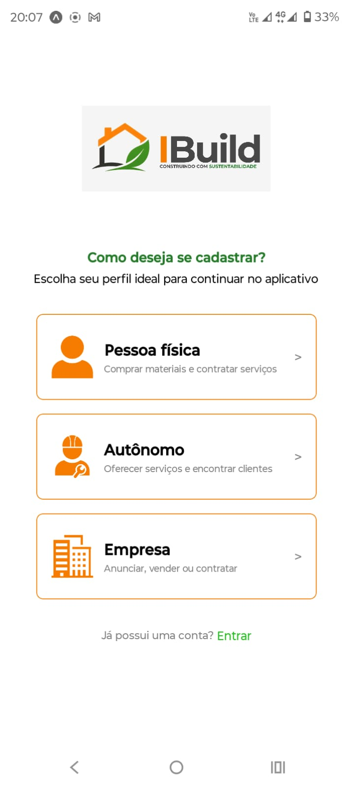
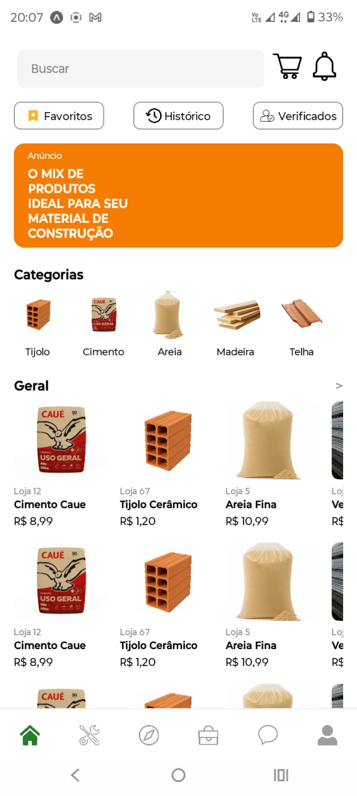
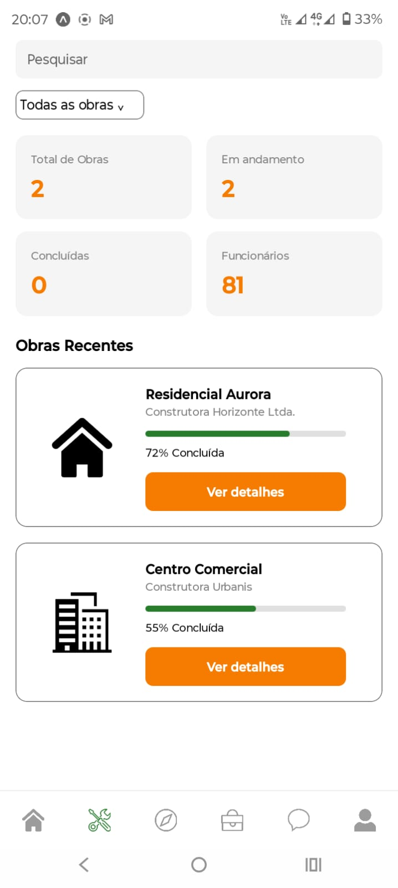

# IBuild - Gestão e Reuso de Insumos Civis Ltda.

## Descrição do Projeto

O IBuild é um aplicativo que promove o reaproveitamento de sobras da construção civil a preços acessíveis, conecta clientes a mão de obra especializada e reduz os impactos ambientais do setor.

## Instalação

1. Clone este repositório em um Codespace (ou pasta local):
```bash
   git clone "https://github.com/MoralesKS/iBuild-TCC.git"
```
2. Entre na pasta do projeto:
```bash
   cd ibuild
```
3. Instale as dependências:
```bash
   npm install
```
4. Rode o projeto:
```bash
   npx expo start --tunnel
```
5. Instale quaisquer dependências adicionais que forem solicitadas durante a execução.

## Funcionalidades

Para essa primeira entrega, temos as seguintes funcionalidades completas e/ou parciais:

- [x] Tela de Login
- [x] Telas de Cadastro
- [x] Navegação entre telas
- [x] Integração com Google Firebase
- [x] Splash Screen
- [x] Marketplace (Home)
- [x] Mapa funcional
- [x] Tela de Gerenciamento de Projetos
- [x] Tela de Contratação de Funcionários
- [x] Carrinho de compras

## Demonstração

<p align="center">
  
  
  
  
</p>

## Tecnologias Utilizadas

- React Native
- Expo
- Google Firebase

## Créditos

Equipe responsável pelo desenvolvimento do IBuild:

|        Nome        |         Função         |
|--------------------|------------------------|
| Arthur R. Araújo   |      Desenvolvedor     |
| Hadan F. Desidério |      Desenvolvedor     |
| Joaquim M. Cunha   |      Desenvolvedor     |
| João M. B. Pagano  |      Desenvolvedor     |
| Kauê S. Morales    |      Desenvolvedor     |
| Nathane de Castro  | Professora Orientadora |
